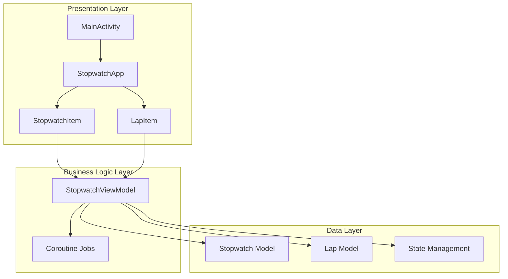

# Technical Architecture Guide 🏗️

## Architecture Overview

### MVVM Pattern Implementation



## Data Flow Architecture

### State Management Flow
```
┌─────────────────┐    ┌─────────────────┐    ┌─────────────────┐
│   User Action   │───►│   ViewModel     │───►│   State Update  │
│   (Tap Start)   │    │   Function      │    │   (isRunning)   │
└─────────────────┘    └─────────────────┘    └─────────────────┘
                                                        │
┌─────────────────┐    ┌─────────────────┐    ┌─────────────────┐
│  UI Recompose   │◄───│  State Observer │◄───│  State Change   │
│   (Button UI)   │    │   (Compose)     │    │   Notification  │
└─────────────────┘    └─────────────────┘    └─────────────────┘
```

### Timer Management Flow
```
startStopwatch(id) ──► ViewModel ──► Create Coroutine Job
        │                  │              │
        │                  │              ▼
        │                  │         ┌─────────────┐
        │                  │         │ Timer Loop  │
        │                  │         │ delay(10ms) │
        │                  │         └─────────────┘
        │                  │              │
        │                  ▼              ▼
        │             Update State ──► UI Update
        │                  │
        ▼                  ▼
   Store Job ID ──► Enable Stop Button
```

## Core Components Deep Dive

### 1. StopwatchViewModel

**Responsibilities:**
- State management for all stopwatches
- Timer lifecycle management
- Coroutine job coordination
- Business logic enforcement

**Key Methods:**
```kotlin
class StopwatchViewModel : ViewModel() {
    // State holders
    private val _stopwatches = mutableStateOf<List<Stopwatch>>(emptyList())
    private val timerJobs = mutableMapOf<String, Job>()

    // Core operations
    fun addStopwatch()
    fun removeStopwatch(id: String)
    fun startStopwatch(id: String)
    fun stopStopwatch(id: String)
    fun recordLap(id: String)
    fun resetStopwatch(id: String)
    fun updateStopwatchName(id: String, newName: String)
}
```

**Memory Management:**
- Automatic job cancellation in `onCleared()`
- Efficient list operations with immutable updates
- Lifecycle-aware coroutine scoping

### 2. Stopwatch Model

**Data Structure:**
```kotlin
data class Stopwatch(
    val id: String = UUID.randomUUID().toString(),
    val name: String = "Cronómetro",
    val currentTime: Long = 0L,          // Milliseconds
    val isRunning: Boolean = false,
    val laps: List<Lap> = emptyList(),
    val startTime: Long = 0L,            // System timestamp
    val pausedTime: Long = 0L            // Accumulated pause time
)
```

**Time Calculation Logic:**
```kotlin
// Real-time calculation
private fun updateTime() {
    val currentSystemTime = System.currentTimeMillis()
    val elapsedTime = currentSystemTime - stopwatch.startTime
    stopwatch.copy(currentTime = elapsedTime)
}
```

### 3. UI Component Architecture

**StopwatchItem Component:**
```kotlin
@Composable
fun StopwatchItem(
    stopwatch: Stopwatch,              // Data source
    onStart: () -> Unit,               // Action callbacks
    onStop: () -> Unit,
    onLap: () -> Unit,
    onReset: () -> Unit,
    onRemove: () -> Unit,
    onNameChange: (String) -> Unit,
    modifier: Modifier = Modifier
)
```

**State Management in UI:**
```kotlin
// Local UI state
var isEditing by remember { mutableStateOf(false) }
var nameText by remember { mutableStateOf(stopwatch.name) }

// External state synchronization
LaunchedEffect(stopwatch.name) {
    nameText = stopwatch.name
}
```

## Performance Optimizations

### 1. Efficient Recomposition
```kotlin
// Key-based LazyColumn for optimal recomposition
LazyColumn {
    items(stopwatches, key = { it.id }) { stopwatch ->
        StopwatchItem(stopwatch = stopwatch, ...)
    }
}
```

### 2. Coroutine Management
```kotlin
// Structured concurrency with automatic cleanup
private fun startTimer(id: String) {
    timerJobs[id] = viewModelScope.launch {
        while (true) {
            delay(10) // Non-blocking delay
            updateStopwatchTime(id)
        }
    }
}
```

### 3. Memory Efficiency
- **Immutable state updates**: Prevents unnecessary object creation
- **Job cancellation**: Automatic cleanup prevents memory leaks
- **Lazy loading**: Lap history loaded on demand

## Threading Model

### Main Thread Responsibilities
- UI updates and recomposition
- User input handling
- State observation

### Background Threads (Coroutines)
- Timer calculations
- State updates
- Long-running operations

### Thread Safety
```kotlin
// Thread-safe state updates
private fun updateStopwatch(updatedStopwatch: Stopwatch) {
    _stopwatches.value = _stopwatches.value.map { stopwatch ->
        if (stopwatch.id == updatedStopwatch.id) updatedStopwatch else stopwatch
    }
}
```

## Error Handling Strategy

### Graceful Degradation
```kotlin
fun startStopwatch(id: String) {
    val stopwatch = _stopwatches.value.find { it.id == id } ?: return

    if (!stopwatch.isRunning) {
        // Safe state transition
        val updatedStopwatch = stopwatch.copy(isRunning = true)
        updateStopwatch(updatedStopwatch)
        startTimer(id)
    }
}
```

### Resource Cleanup
```kotlin
override fun onCleared() {
    super.onCleared()
    timerJobs.values.forEach { it.cancel() }
    timerJobs.clear()
}
```

## Testing Strategy

### Unit Testing Targets
- **ViewModel Logic**: Timer operations, state management
- **Model Functions**: Time formatting, calculations
- **Business Rules**: Lap recording, name validation

### Integration Testing
- **UI Components**: User interaction flows
- **State Synchronization**: ViewModel-UI communication
- **Lifecycle Events**: App pause/resume behavior

### Performance Testing
- **Memory Usage**: Multiple stopwatch scenarios
- **Timer Accuracy**: Long-running precision tests
- **UI Responsiveness**: Smooth animation verification

## Build Configuration

### Gradle Modules
```kotlin
// App-level build.gradle.kts
android {
    compileSdk = 36

    defaultConfig {
        minSdk = 28
        targetSdk = 36
        versionCode = 1
        versionName = "1.0"
    }

    buildFeatures {
        compose = true
    }
}
```

### Dependencies Management
```kotlin
dependencies {
    // Core Android
    implementation(libs.androidx.core.ktx)
    implementation(libs.androidx.lifecycle.runtime.ktx)

    // Compose BOM for version alignment
    implementation(platform(libs.androidx.compose.bom))
    implementation(libs.androidx.ui)
    implementation(libs.androidx.material3)

    // Activity Compose integration
    implementation(libs.androidx.activity.compose)
}
```

## Security Considerations

### Data Privacy
- **No network communication**: All data stays local
- **No sensitive data storage**: Only timing information
- **No permissions required**: Self-contained application

### App Security
- **Obfuscation enabled** in release builds
- **Debug information stripped** in production
- **Secure coding practices** throughout codebase

## Deployment Configuration

### Release Build
```kotlin
buildTypes {
    release {
        isMinifyEnabled = false  // Can be enabled for production
        proguardFiles(
            getDefaultProguardFile("proguard-android-optimize.txt"),
            "proguard-rules.pro"
        )
    }
}
```

### Signing Configuration
```bash
# Generate release key
keytool -genkey -v -keystore release-key.keystore -keyalg RSA -keysize 2048 -validity 10000

# Build signed APK
./gradlew assembleRelease
```

---

*This technical guide provides comprehensive insights into the MultiStopwatch application architecture, enabling developers to understand, maintain, and extend the codebase effectively.*